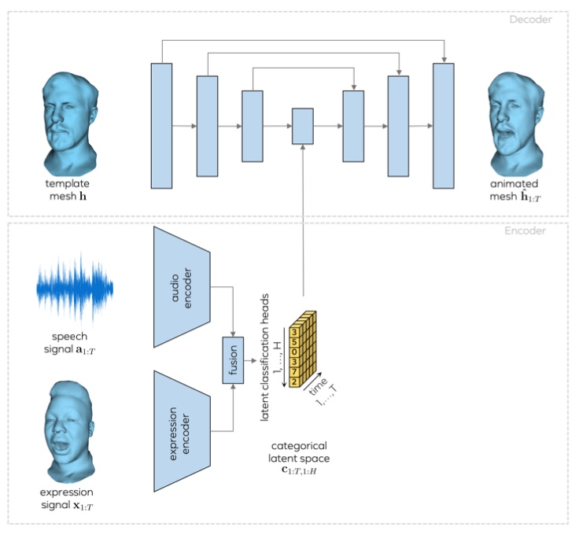
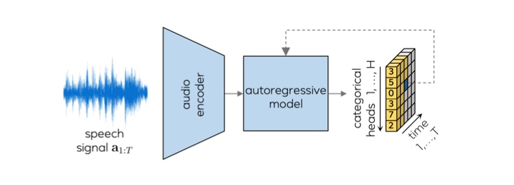
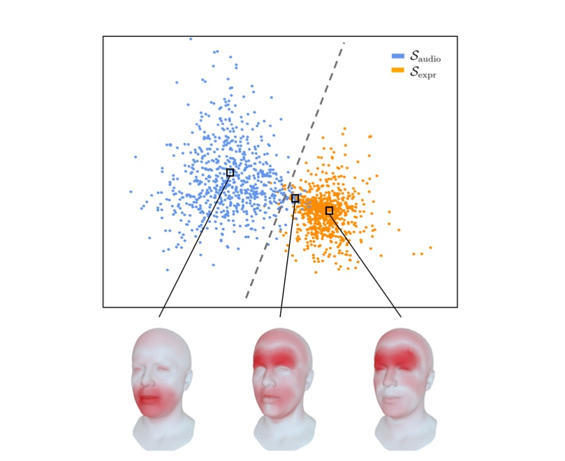
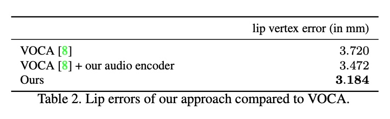
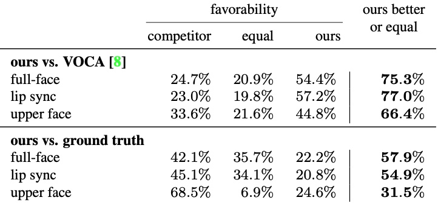

# MeshTalk

## 3D Face Animation from Speech using Cross-Modality Disentanglement

---

## Authors

Alexander Richard, Michael Zollhofer, Yandong Wen, Fernando de la Torre, Yaser Sheikh

--

## Resources

[paper](https://arxiv.org/abs/2104.08223)

[project page](http://www.zollhoefer.com/papers/arXiv21_MeshTalk/page.html)

[supp video](https://research.fb.com/wp-content/uploads/2021/04/mesh_talk.mp4)

--

## Venue

Arxiv only it appears - not peer reviewed - but a quality lab.

---

## Research Goal

Generalised 3D facial animation - ie. not speaker specific.

Accurate lip sync, realistic upper facial expression.

Note: No rigid head pose

--

#### Prior Work  - Viseme based

- Static shapes employing some sort of interpolation
- Remains popular with animation software
- Not a good model of speech
- Requires considerable labelling of data

--

#### Speech-driven 2D talking heads

- Very realistic
- Only 2D - pixels not shapes.
- Works best on lips - not so good on rest of face.
- Failures under larger poses.

--

#### Speech-driven 3D talking heads

- 3D
- Speaker specific models can be very realistic (Codec Avatar).
- Difficult to find or record data
- Works best on lips - not so good on rest of face.
- Often no rigid pose.

---

## Key Idea

Disentangle the latent pose space.

Keep the lip sync aligned with speech

Blinks, etc. not aligned with speech, are autoregressive.

---

## Data

- 250 subjects
- 50 phonetically balanced sentences each
- 30 fps, 80 cameras, 6k vertices on the mesh
- audio 16khz
- 13 hours total

--

Split on sentences for train and testing

- 40 sentences for training
- 10 sentences for testing

--

## Audio Feature Extraction

80D Mel Spectrogram (Fbank) 10ms window

600ms (-500 to +100) for each mesh

---

# Method

--

## Network

Note: its a neural network

--

Audio encoder is 1D temporal CNN

Expression encoder is 3 FNN, 1 LSTM

Decoder is U-Net, to keep close to template identity.

U-Net is FNN and LSTM

--

## Cross modality loss

L2 loss confuses the upper expression with the required lip sync.

Mismatch audio and expression and use a loss function for each zone.

Also, an additional separation for eyelids.

Note: not quite clear on exactly how the training occurs - I assume
infer one version, then the next version and back prop the weighted sum.

--

## Latent space

Continuous-valued encoding is transformed to categorical representation.

Justification refers to the literature, and the need to limit space size.

--

## Latent space

$T \times H \times C$ dimensions

$T$ is a feature sequence 

$H = 64$ categorical head

$C = 128$ categories

--

## Latent space

Continuous values transformed to categories with Gumbel-softmax

They state category space is $C^H$ which is a 135 digit number!

Note: Not quite sure - but I think each sequence forms a category

--

## Audio Autoregression

Audio only testing uses autoregressive network.

Trained independently after the main network (3.2)

Temporal CNN, 4 layers, similar to PixelCNN

Note: Audio-conditioned latent codes are sampled for each position 
ct,h in the latent expression space, where the model only has 
access to previously generated labels

---

## Results and Evaluations

video on project page

--

## Latent Space

visualisation of latent space activated by modalities

the video includes some evaluations of latent space

Note: Visualization of the latent space. 
Latent configurations caused by changes in the audio input are clustered together. 
Latent configurations caused by changes in the expression input form another cluster. 
Both clusters can be well separated with minimal leakage into each other.

--

## Quantitative 

measurements of lip position compared to ground truth

error $\approx 3$ mm

--

## User study

Method generally preferred over competitor (VOCA).

Not as close to GT as I expected.

Users don't like the upper expression so much.

--

## Alternate Test Cases

1. Re-Targeting 
2. Mesh Dubbing

Again, see the video on the project page.

Note: Retargetting means change the mesh identity for output
Dubbing means change the speech.

---

## Limitations

100ms look ahead

computationally expensive

they mention face tracker failure?? perhaps when live dubbing?

---

## Thoughts

the autoregressive audio test case could be further exploited to model silence

no rigid pose ?

Note: References of both Sarah, and myself. Spelt my name wrongly!!

--

# Questions
